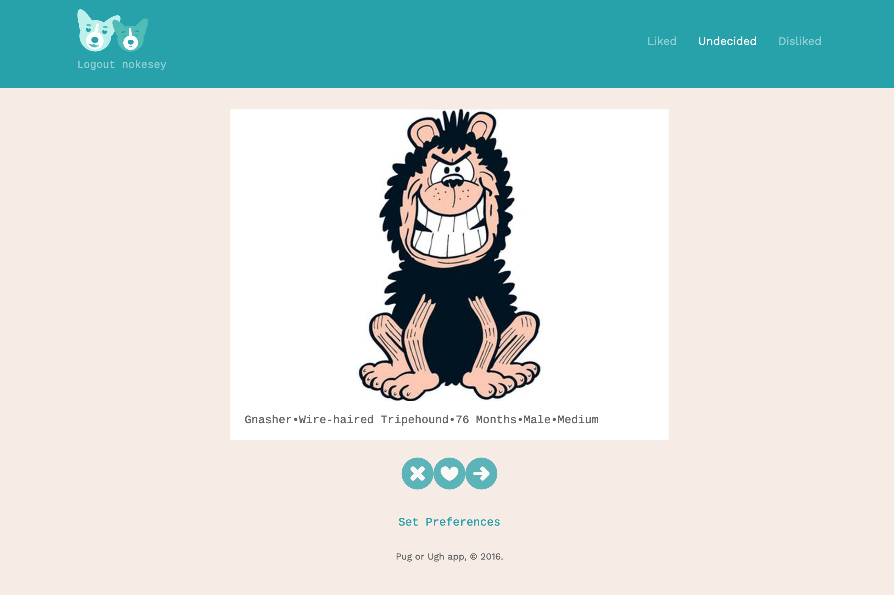

# Pug or Ugh

## Description

A series of APIs built in [Django Rest Framework](https://www.django-rest-framework.org/) 
to power a provided Angular application for Project 11 of the 
[Treehouse](https://teamtreehouse.com/) Python Web Development course.

Full details of the project, including API documentation and 
test user account details can be found in the 
[wiki](https://github.com/gidsey/project_11/wiki).

## Extra Credit

Additional API routes have been added to fulfil the 'exceeds expectations' section of the project rubric.

* Endpoints to add or delete a dog:

	* `/api/dog/add/`
	* `/api/dog/<pk>/delete/`

Additional data fields have been added to the Models which increase the application’s functionality.

`Dog Model` has additional 'microchipped' field indicating whether the dog has been microchipped or not. 
This is a boolean field.

`UserPref Model` also stores the users 'microchipped' preferences. This can be set to 'y' (yes), 
'n'(no) or 'e'(either). 

`UserDog Model` now stores a blacklist for Dogs. These are stored on a per-user basis. This is a boolean field.

The logic for each view has been updated to account for the additional data fields detailed above and [demo 
user accounts](https://github.com/gidsey/project_11/wiki/Test-User-Accounts) can be found in the wiki, 
which allow these to be tested. However, The frontend Angular application has not been updated to 
include these additional data fields.

### Validation

Validation has been added to the serializers to preserve data integrity. 

### Unit Tests

Unit tests cover more than 75% of the views, models, and other functions.

## Atributions

[Scooby-Doo](https://en.wikipedia.org/wiki/Scooby-Doo_(character)) by 
[Joe Ruby](https://en.wikipedia.org/wiki/Joe_Ruby) and 
[Ken Spears](https://en.wikipedia.org/wiki/Ken_Spears), 
[Hanna-Barbera Productions, Inc.](https://en.wikipedia.org/wiki/Hanna-Barbera)
 
[Droopy](https://en.wikipedia.org/wiki/Droopy) by 
[Tex Avery](https://en.wikipedia.org/wiki/Tex_Avery)

[Gnasher](https://en.wikipedia.org/wiki/Gnasher) by 
[Ian Gray](https://en.wikipedia.org/wiki/Ian_Gray_(comics)) and
[David Law](https://en.wikipedia.org/wiki/David_Law_(cartoonist))

[Gromit](https://en.wikipedia.org/wiki/Wallace_and_Gromit#Gromit) by 
[Nick Park](https://en.wikipedia.org/wiki/Nick_Park)

[Snoopy](https://en.wikipedia.org/wiki/Snoopy) by
[Charles M. Schulz](https://en.wikipedia.org/wiki/Charles_M._Schulz)

[Huckleberry Hound]([https://en.wikipedia.org/wiki/Huckleberry_Hound) by
[William Hanna](https://en.wikipedia.org/wiki/William_Hanna) and
[Joseph Barbera](https://en.wikipedia.org/wiki/Joseph_Barbera)

Project work by [Chris Guy](https://www.linkedin.com/in/gidsey/), April 2020